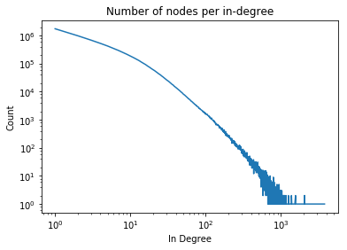
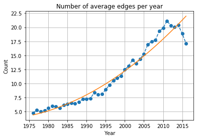
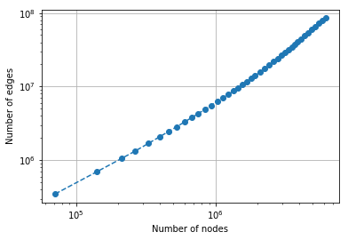
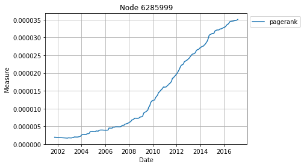

# Patent Analysis

This is a tool to download US Patent information, particularly, citation network from
[patentsview.org](http://www.patentsview.org) and store into [MongoDB](https://www.mongodb.com/) to analyze.
Currently, this dataset contains 6.215.171 patents (verticies) and 86.184.397 citations (edges).

For example, we can draw _in-degree_ distribution of the citation network.



or average citations (out-degree) added per year:



or edge/node (loglog) count over time:



See [the notebook](Retriever.ipynb) for other demos.

## Getting Started

### 1) Python dependencies

First, you need to have the required packages under [requirements.txt](requirements.txt).
You can install using `virtualenv` or to user.

### 2) Database

Second, you need a MongoDB running.
If you have `docker` you can use following line to run an instance:

```
$ docker run --name patent-mongo -v `pwd`/db:/data/db -p 27017:27017 -d mongo:3.4.6
```

(If your db host is not localhost, set it with environment vars like
  `$ export MONGO_URL="mongodb://host:27017"`
before running the app.)

### 3) Downloading and storing the dataset:

This will download the dataset from
[patentsview.org/download/](http://www.patentsview.org/download/):

```
$ ./download_data.sh
```

Now inserting it to the db:

```
$ python -m patent_analysis.insert_db
```

(It takes ~4h with SSD Disk!)

Now we are ready to work on the patent data.

## Roadmap

* Queries for WIPO categories
* Centrality measure analysis such as `PageRank`
  
* Community analysis
* Embeddings
* Assignee network analysis
* ...

## License

Released under [the MIT license](LICENSE).
